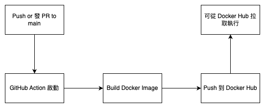

# cloud_native_hw4

這是一個用於展示如何使用 Docker 打包並執行應用程式的簡單範例。

---

## 🐳 如何使用 docker build 打包應用程式
在 terminal 輸入
```bash
docker build -t yrchen19/2025cloud:hello1 .
```

## 如何使用 docker run 執行 Container Image
選項一：執行本地 build 出來的 Image
```bash
docker run yrchen19/2025cloud:hello1
```
輸出會是
```
Hello from Docker homework!
```

選項二：直接從 Docker Hub 執行 Image
如果你沒有本地 image，也可以直接從 Docker Hub 執行已上傳的版本：
```bash
docker run yrchen19/2025cloud:hello1
```
Docker 會自動從 Docker Hub 下載 hello1 這個 tag 的 image 並執行。

輸出會是
```
Hello from Docker homework!
```

## 整體流程圖


## Tag 的設計邏輯
目前專案採用固定 tag hello1，主要目的為簡化測試與展示流程，方便 Docker Hub 中統一更新與管理。